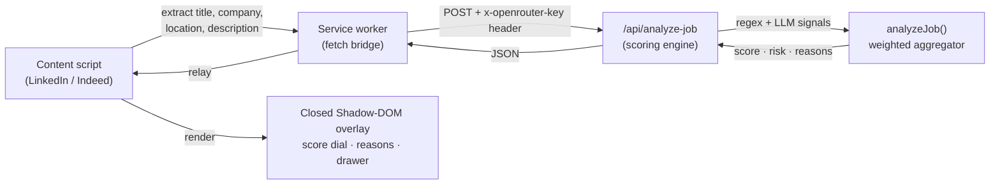

<div align="center">

# 👻 Ghost Job Detector

### Know if a job is real **before** you waste an hour applying.

A Chrome extension that scores every LinkedIn & Indeed posting **0–100 for legitimacy** — right on the page, in under three seconds. AI-powered. Bring-your-own-key. Zero tracking.

<br/>

[](https://developer.chrome.com/docs/extensions/mv3/intro/)
[](https://wxt.dev/)
[](https://react.dev/)
[](https://www.typescriptlang.org/)
[](https://tailwindcss.com/)
[](https://openrouter.ai/keys)
[]()

[**What it does**](#-the-three-second-moment) ·
[**Live demo**](#-live-demo) ·
[**Features**](#-features) ·
[**How scoring works**](#-how-the-score-works) ·
[**Install**](#-install-the-extension) ·
[**Privacy**](#-privacy--byok) ·
[**Architecture**](#-under-the-hood)

</div>

<!--
  📸 DEMO ASSET: drop a screen recording of the overlay appearing on a real
  LinkedIn job at docs/demo.gif and uncomment the block below for max impact.

  <div align="center"></div>
-->

---

## 🎯 The three-second moment

"Ghost jobs" are everywhere — postings left open with no intent to hire, AI-generated filler, recruiter word-salad, and outright scams. Job seekers burn hours tailoring applications to listings that were never real.

**Ghost Job Detector kills that guesswork.** Open any LinkedIn or Indeed job and an isolated overlay slides in with a verdict you can trust at a glance:

```
        ╭──────────────────────────────╮
        │            ┌────────┐         │   🟢  Legitimate        80–100
        │            │   87   │  🟢     │   🟡  Caution           50–79
        │            └────────┘         │   🟠  Suspicious        20–49
        │         Looks legitimate      │   🔴  Likely ghost job   0–19
        │                               │
        │  ✓ Concrete salary & stack    │
        │  ✓ Named team and manager     │
        │  ⚠ Mild buzzword density      │
        ╰──────────────────────────────╯
```

A **0–100 trust score**, a **color-coded risk band**, and **3–5 plain-English reasons** — without leaving the page, without copy-pasting, without an account.

> [!NOTE]
> The extension reads only the posting **you are already looking at**. It never scrapes behind login walls and never fetches job sites in the background.

<div align="right"><a href="#-ghost-job-detector">↑ back to top</a></div>

---

## 🎥 Live demo

Watch Ghost Job Detector score a real LinkedIn posting in seconds:

<div align="center">

[](https://youtu.be/mq91K4oiq1c)

**▶ [https://youtu.be/mq91K4oiq1c](https://youtu.be/mq91K4oiq1c)**

</div>

<div align="right"><a href="#-ghost-job-detector">↑ back to top</a></div>

---

## ✨ Features

### On the job page

|     | Feature                                                                                                                         |
| --- | ------------------------------------------------------------------------------------------------------------------------------- |
| 🛡️  | **Auto-activating overlay** on `linkedin.com/jobs/*` and `indeed.com/*` job-detail pages — no clicks required.                  |
| 🎬  | **Animated trust dial** that counts up to the score with a color-coded band the instant analysis returns.                       |
| 🧾  | **Signed reasons** — green flags _and_ red flags in one ranked list, each in plain English.                                     |
| 🔍  | **Signal breakdown drawer** revealing exactly which signals moved the score and by how much.                                    |
| 🔄  | **Soft-nav aware** — click between listings in LinkedIn's SPA and the overlay re-scores the new job automatically.              |
| 🧱  | **Closed Shadow DOM + `adoptedStyleSheets`** so the overlay's styles can never clash with — or be clobbered by — the host page. |
| 🫥  | **Honest empty state** — if a posting can't be read, you get a "couldn't read this posting" message, never a misleading zero.   |

### Popup & side panel

|     | Feature                                                                                              |
| --- | ---------------------------------------------------------------------------------------------------- |
| 👋  | **First-run onboarding** that walks new users through the verdict in seconds.                        |
| 🧪  | **Live sample postings** — one per risk band — so you can see the product work with zero setup.      |
| 📜  | **Scan history** persisted locally (last 50 scans), re-openable any time.                            |
| 👻  | **"Ghosts dodged" counter** — a running tally of suspicious/ghost listings you've been warned about. |
| 📤  | **Share-verdict card** to screenshot and send a result to a friend.                                  |
| 🪟  | **Expand to side panel** for a roomy, two-pane view alongside your browsing.                         |
| 🌗  | **Dark / light theme toggle** with a polished, motion-aware UI (respects `prefers-reduced-motion`).  |
| 📡  | **Offline-aware** — a clear banner instead of a cryptic failure when the network drops.              |

### Settings (Options page)

|     | Feature                                                                                                                        |
| --- | ------------------------------------------------------------------------------------------------------------------------------ |
| 🔑  | **Bring-your-own OpenRouter key** with live `sk-or-v1-…` format validation and show/hide.                                      |
| ✅  | **"Test key"** button verifies your key against OpenRouter in one call and reports success / invalid / rate-limited / offline. |
| 🟢  | **Connection status pill** showing whether a key is saved (and its last 4 chars).                                              |
| 🗑️  | **One-tap key removal** with a confirm step — wipes it from the device instantly.                                              |
| 📖  | **Plain-language privacy disclosure** — what's sent, where the key lives, and what the extension will never do.                |

<div align="right"><a href="#-ghost-job-detector">↑ back to top</a></div>

---

## 🧠 How the score works

Every posting first passes a **triage gate** (`isLikelyJobPosting`). If it isn't actually a job posting, the engine returns a neutral "can't tell" instead of inventing a score.

Real postings are then run through **five independent signals**. Each returns the same uniform `{ ghostiness, confidence, evidence }` shape, and a **weight-renormalizing aggregator** blends them — it never branches on which signal produced the number.

| Signal                     | Weight | What it catches                                         | Powered by |
| -------------------------- | :----: | ------------------------------------------------------- | :--------: |
| 🤖 **AI-generated text**   |  30%   | Postings that read like an LLM wrote them               |    LLM     |
| 🎯 **Specificity**         |  25%   | Missing salary, stack, seniority, team, benefits        |   Regex    |
| 🗣️ **Buzzword density**    |  20%   | "Rockstar / ninja / wear many hats / fast-paced"        |   Regex    |
| 🚩 **Scam patterns**       |  15%   | Urgency, off-platform contact, unrealistic comp         |   Regex    |
| ⚖️ **LLM legitimacy eval** |  10%   | A structured authenticity judgment of the whole posting |    LLM     |

```
final score = 100 − Σ ( signal.ghostiness × normalized_weight )
```

**Smart fallbacks baked in:**

- 🔌 **No API key? Still works.** The two LLM signals drop out and the remaining weights **renormalize across the heuristics** — there is no separate "heuristics-only" code path to drift out of sync.
- 🎚️ **Fewer false alarms.** A posting that's highly _specific_ but a little buzzwordy gets its buzzword weight halved — concrete detail outranks vibes.

### Risk bands

| Band                    | Score  | Meaning                               |
| ----------------------- | :----: | ------------------------------------- |
| 🟢 **Legitimate**       | 80–100 | Specific, well-formed, human-written  |
| 🟡 **Caution**          | 50–79  | Some weak signals — read carefully    |
| 🟠 **Suspicious**       | 20–49  | Multiple red flags                    |
| 🔴 **Likely Ghost Job** |  0–19  | Strong scam / ghost / AI-spam signals |

<div align="right"><a href="#-ghost-job-detector">↑ back to top</a></div>

---

## 🔒 Privacy & BYOK

Privacy isn't a footnote here — it's the architecture.

- **Bring your own key.** You supply a free [OpenRouter](https://openrouter.ai/keys) key (default model `openai/gpt-4o-mini`). It's stored only in `chrome.storage.local` on your device.
- **The key is never logged or stored server-side.** It travels only in the `x-openrouter-key` request header — never the body, query string, or an env var. There is intentionally no server-side key fallback.
- **Minimal data leaves your browser.** Only the **title, company, location, and description** of the posting are analyzed — **never the page URL**, never your identity.
- **No accounts. No tracking. No analytics. No database. No cross-device sync.** Uninstall the extension and your key and history are gone with it.

<div align="right"><a href="#-ghost-job-detector">↑ back to top</a></div>

---

## 🚀 Install the extension

> The extension is distributed as an **unpacked (sideloaded)** build — load it in under a minute.

### Prerequisites

- **Node.js 22 LTS** and **npm 10+**
- A **Chromium browser** (Chrome, Edge, Brave, Arc, …)
- A free **OpenRouter API key** — [openrouter.ai/keys](https://openrouter.ai/keys) (format `sk-or-v1-…`)

### 1 · Build it

```bash
git clone https://github.com/DhruvBabariya-solutelabs/ghost-job-detector.git
cd ghost-job-detector
npm install
npm run build --workspace=apps/extension
# → output: apps/extension/.output/chrome-mv3/
```

### 2 · Load it into Chrome

1. Open `chrome://extensions`
2. Toggle **Developer mode** (top-right)
3. Click **Load unpacked** → select `apps/extension/.output/chrome-mv3/`
4. Click the puzzle-piece icon and **pin** Ghost Job Detector 📌

> [!TIP]
> Already had a job tab open? After pinning, do a **hard reload** of your LinkedIn job-detail page (`Ctrl`/`Cmd` + `Shift` + `R`) so the content script injects and the score overlay pops up.

### 3 · Add your key

1. Click the extension → ⚙️ **Settings & API key**
2. Paste your `sk-or-v1-…` key → **Save key**
3. (Optional) **Test key** to confirm it works against OpenRouter

### 4 · Use it

Open any **LinkedIn** (`linkedin.com/jobs/*`) or **Indeed** job posting — the overlay appears and scores it automatically. Click between listings and it re-scores each one.

> [!TIP]
> The two AI signals need your key, but the extension still scores postings with its regex heuristics alone if you skip it — just less precisely.

<div align="right"><a href="#-ghost-job-detector">↑ back to top</a></div>

---

## 🏗️ Under the hood

The extension never calls the AI provider directly. The **service worker** owns all network I/O (content scripts are bound by the host page's CORS policy), and a small serverless route runs the scoring engine so your key is the only secret on the wire.



**Extraction strategy:** JSON-LD (`<script type='application/ld+json'>`) is tried first, with comma-separated CSS-selector fallbacks per board — isolated behind a `JobBoardAdapter` interface (`Document → JobPosting | null`) so adding a new job board is a single new adapter.

### Tech stack

| Layer               | Choice                                                                                               |
| ------------------- | ---------------------------------------------------------------------------------------------------- |
| Extension framework | **WXT 0.20** + `@wxt-dev/module-react` (auto-generates the MV3 manifest, HMR for content/SW/options) |
| UI                  | **React 19** + **TypeScript 5.7** (strict, `noUncheckedIndexedAccess`)                               |
| Styling             | **Tailwind v4** (CSS-first `@theme`), injected via `adoptedStyleSheets`                              |
| AI                  | **OpenAI SDK** pointed at **OpenRouter** — Chat Completions + Structured Outputs (`strict: true`)    |
| Contracts           | **Zod** — one schema validates the wire payload _and_ types the engine + UI                          |
| Persistence         | `chrome.storage.local` (key, history, theme, onboarding, ghosts-dodged)                              |
| Monorepo            | npm workspaces + **Turborepo** · lint/format by **Biome 2**                                          |

### Repository layout

```
ghost-job-detector/
├─ apps/
│  └─ extension/                     # 👈 the product
│     ├─ entrypoints/
│     │  ├─ background.ts            # service worker — the only place fetch() runs
│     │  ├─ content.ts               # injects the overlay, watches for soft-nav
│     │  ├─ popup/                   # toolbar popup (gauge, reasons, history, share)
│     │  ├─ sidepanel/               # expanded two-pane view
│     │  └─ options/                 # BYOK key entry + privacy disclosure
│     └─ src/
│        ├─ content/adapters/        # linkedin.ts, indeed.ts  ← the extraction seam
│        ├─ content/overlay/         # ScoreDial, ReasonsList, SignalBreakdownDrawer…
│        └─ lib/                     # messages (typed RPC) + storage
└─ packages/
   ├─ shared/    # framework-free Zod contracts, risk bands, design tokens, fixtures
   └─ scoring/   # pure-TS engine: extractors + weight-renormalizing aggregator + labeler
```

### Development

```bash
npm run dev                          # WXT dev build with HMR + local scoring API
npm run typecheck                    # tsc --noEmit everywhere — the primary safety net
npm run lint                         # Biome lint
npm run format                       # Biome format --write
```

> [!IMPORTANT]
> The extension talks to the scoring API defined by `ANALYZE_BASE_URL` in `packages/shared/src/contracts.ts`. In this repo it points at `http://localhost:3000` for local development — start the dev server (or repoint it at your deployed endpoint) so AI scoring works end-to-end.

<div align="right"><a href="#-ghost-job-detector">↑ back to top</a></div>

---

## ❓ FAQ & troubleshooting

<details>
<summary><b>The overlay isn't showing up.</b></summary>

Make sure you're on a **job-detail** page (`linkedin.com/jobs/view/…` or an Indeed posting), not a search-results list. Reload the tab after first installing. If you just rebuilt the extension, hit the reload icon on `chrome://extensions`.

</details>

<details>
<summary><b>Do I have to pay for the AI?</b></summary>

You bring your own OpenRouter key and pay only OpenRouter's pay-as-you-go rate for the default `openai/gpt-4o-mini` model — fractions of a cent per scan. The maintainers never see or pay for your usage.

</details>

<details>
<summary><b>Does it work without a key?</b></summary>

Yes — the three regex signals (specificity, buzzwords, scam patterns) still run and the weights renormalize across them. The two LLM signals simply sit out until you add a key.

</details>

<details>
<summary><b>"Couldn't read this posting" — why?</b></summary>

The page didn't expose enough structured content to extract a posting (or you're behind a login/preview state). The extension deliberately shows this instead of faking a score. Try opening the full job-detail view.

</details>

<details>
<summary><b>Is my OpenRouter key safe?</b></summary>

It's stored only in <code>chrome.storage.local</code> on your device and sent solely in the <code>x-openrouter-key</code> request header. It is never logged or persisted on any server, and never written to a body, URL, or env var.

</details>

<details>
<summary><b>Which job boards are supported?</b></summary>

LinkedIn and Indeed today. Support is behind a <code>JobBoardAdapter</code> interface, so adding another board is a single self-contained adapter file.

</details>

<div align="right"><a href="#-ghost-job-detector">↑ back to top</a></div>

---

<div align="center">

**Stop applying to ghosts.** 👻

Built with WXT · React · TypeScript · OpenRouter — _BYOK, private by design._

</div>
